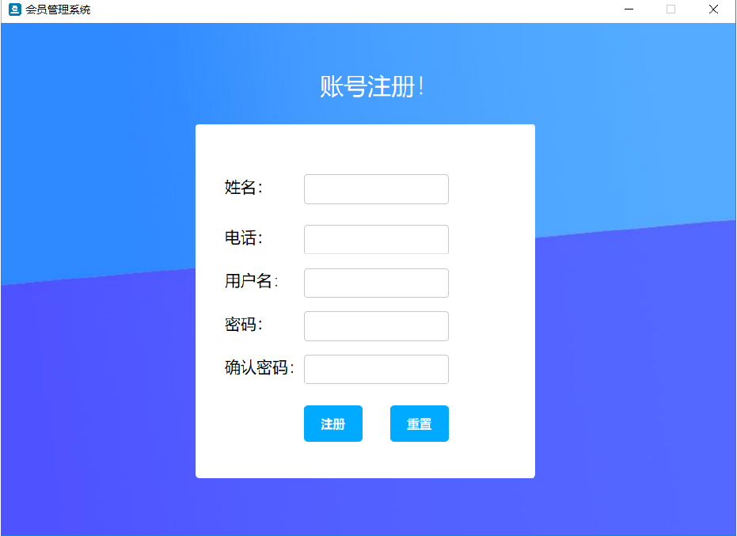

# 会员管理系统

## 项目说明
该项目为C++课程大作业，无特别参考价值，发布仅供记录，部分功能并不完善。

## 项目依赖
Qt版本：5.12.0或更高
数据库：Sqlite
语言：C++

## 项目架构
会员管理系统使用Qt编写，遵循UI与业务逻辑分离的设计原则。

### 主要模块
- 登录窗口 对应loginwindow.ui，是用户登录连接聊天服务器的界面。
- 注册窗口 对应 registwindow.ui，是用户在相应服务器注册帐号的界面。
- 程序主界面 对应 mainwindow.ui 是程序功能主要界面。
- 其他窗口 包括添加优惠信息窗口，添加活动信息窗口等。


### 文件组织
```
项目目录
├── LICENSE
├── README.md
└── MyMMS
    ├── MyMMS.pro      -- 项目文件
    ├── *.cpp *.h ... -- 源代码文件和头文件
    ├── *.ui      ... -- UI 布局文件
    ├── resources.qrc -- 资源文件
    └── images        -- 图片资源文件夹
        ├── 1.png
        ├── 2.png
        └── ...
```

## 部分界面





